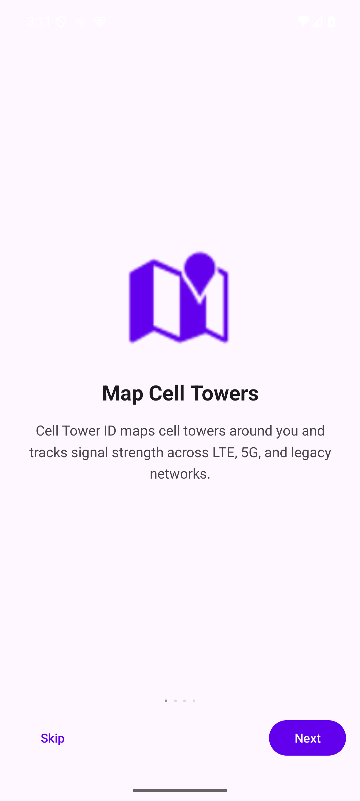
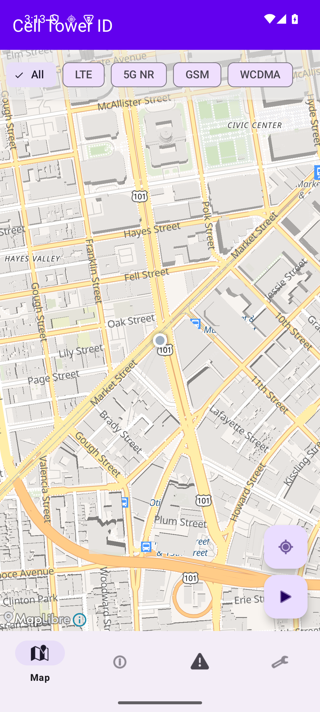
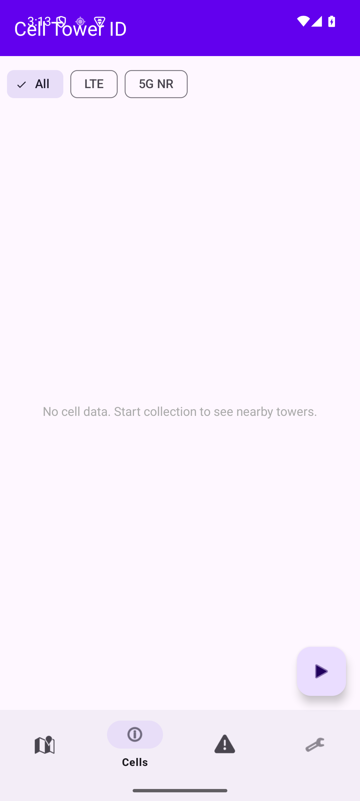
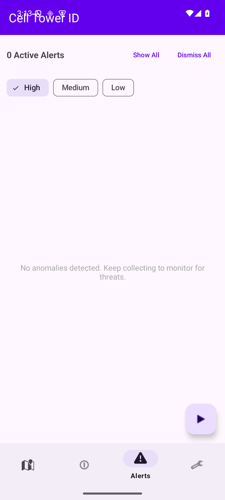
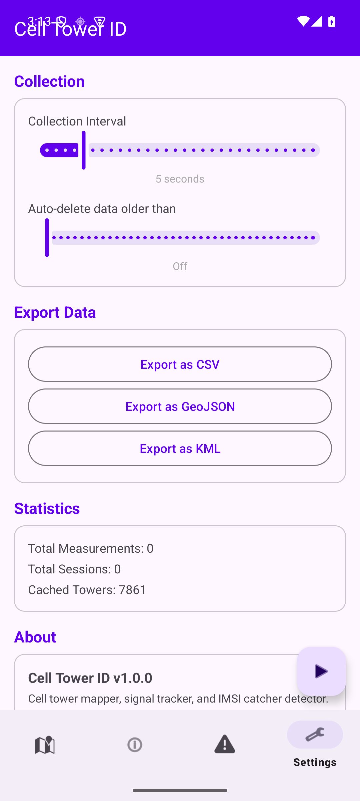

# Cell Tower ID

An Android app for mapping cell towers, tracking signal strength, and detecting IMSI catchers. All data stays on your device.

## Features

- **Cell Tower Mapping** — Interactive map with signal strength heatmaps, filterable by LTE, 5G NR, GSM, and WCDMA
- **Signal Tracking** — Continuous collection sessions that log tower observations as you move
- **IMSI Catcher Detection** — Seven passive detection heuristics: unknown towers, signal anomalies, forced 2G downgrades, transient towers, impossible location jumps, LAC/TAC changes, and operator mismatches
- **Tower Locator** — Walk toward a specific cell tower using real-time hot/cold signal feedback
- **Data Export** — CSV, GeoJSON, and KML formats for external analysis
- **Privacy First** — No cloud sync, no analytics, no tracking. All data is local.

## Screenshots

<p float="left">
  
  
  
  
  
</p>

## Build

```bash
./gradlew assembleDebug          # Debug APK
./gradlew bundleRelease          # Signed release AAB
./gradlew test                   # Unit tests
./gradlew connectedAndroidTest   # Instrumented tests
```

**Requirements:** Android Studio, JDK 11+, Android SDK 35

**Min SDK:** 24 (Android 7.0) | **Target SDK:** 35 (Android 15)

## Architecture

MVVM + Repository pattern in Kotlin/Java.

```
app/src/main/java/com/terrycollins/celltowerid/
  ui/           Activities, Fragments, Adapters, ViewModels
  service/      CollectionService, AnomalyDetector, CellInfoProvider
  repository/   Data access layer
  domain/model/ Domain models
  data/         Room entities, DAOs, database
  export/       CSV, GeoJSON, KML exporters
  util/         Parsers, helpers, logging
```

**Key dependencies:** MapLibre, Room, Google Play Services Location, WorkManager, Gson

## Anomaly Detection

Cell Tower ID scores each observation against nine heuristics:

| Check | What it detects |
|-------|----------------|
| Signal Anomaly | RSRP 20+ dBm above the operator's local average |
| 2G Downgrade | Forced switch from LTE/NR to GSM |
| 3G Downgrade | Forced switch from LTE/NR to WCDMA/CDMA |
| LAC/TAC Change | Unexpected service area change |
| Transient Tower | Appears and disappears in <5 minutes |
| Operator Mismatch | Unknown MCC/MNC combination |
| Impossible Tower Move | Tower >20km from a previously observed position |
| Suspicious Proximity | Timing Advance ~0 but only moderate signal strength |
| PCI Instability | Cell broadcasting a different PCI than previously seen |

Scores are bucketed: 0-2 Low, 3-5 Medium, 6+ High.

## Privacy

- All data stored locally in SQLite (Room)
- No network requests except map tile fetches (OpenFreeMap)
- No device identifiers collected (no IMEI, IMSI, phone number)
- Configurable auto-delete retention (0-365 days)
- User-initiated export only

[Privacy Policy](https://cell-tower-id.com/privacy.html)

## License

All rights reserved.
